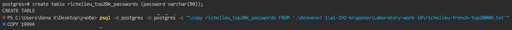
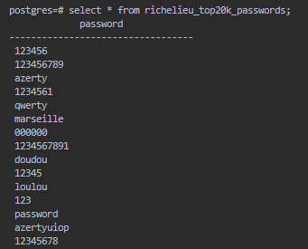
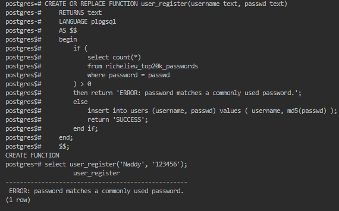
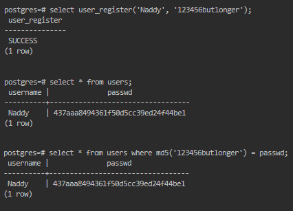
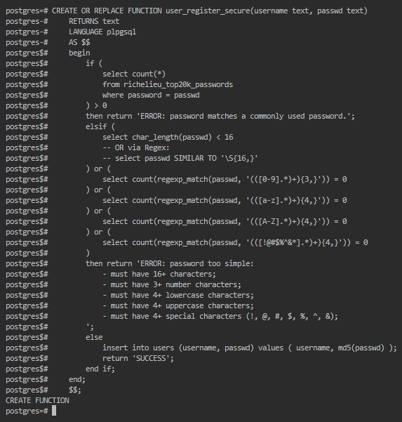
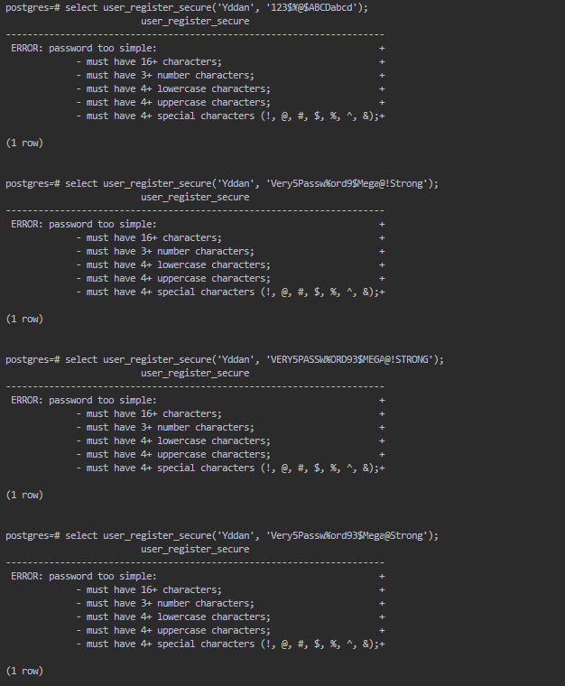
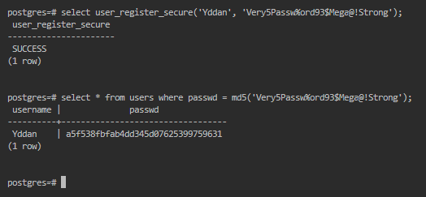

> В репозиторії https://github.com/danielmiessler/SecLists/tree/master/Passwords
> розміщено файли зі списку "10000 найгірших паролів", назви яких представлено в таблиці 1.
> Отримати файл, номер якого відповідає вашому варіанту.

> Створити таблицю в БД СКБД PostgreSQL, назва якої відповідає назві файлу, та
> завантажити вміст файлу у таблицю, використовуючи будь-який засіб імпорту, наприклад,
> команду \COPY утиліти psql.

Створено таблицю 'richelieu_top20k_passwords', завантажено 19994 паролів.

> Створити функцію user_register на мові програмування PL/pgSQL, яка буде
> забороняти створювати пароль, якщо він є у таблиці гірших паролів.

> Провести тестування роботи функції user_register за двома тестовими
> сценаріями (правильний та неправильний)

Створення функції та невдале створення користувача (*123456 - поганий пароль*):

Вдале створення користувача:

    
> 2.3.1 Припустимо, що з урахуванням рекомендацій посібника NIST 800-63 «Digital
> Identity Guidelines. Authentication and Lifecycle Management», розміщенного за адресою
> https://pages.nist.gov/800-63-3/sp800-63b.html, пропонуються наступні умови надійності паролю користувача:

> 1) довжина рядка не менше `N1 = 16` символів;
> 2) не менше `N2 = 3` символів – цифра;
> 3) не менше `N3 = 4` символів у нижньому регістрі;
> 4) не менше `N4 = 4` символів у верхньому регістрі;
> 5) не менше `N5 = 4` спеціальних символів з множини {!@#$%^&

Невдалі спроби:

- `123$%@$ABCDabcd` - немає 16+ символів (*лише 15*), але інші умови виконуються;
- `Very5Passw%ord9$Mega@!Strong` - немає 3+ цифр (*лише 2*), але інші умови виконуються;
- `VERY5PASSW%ORD93$MEGA@!STRONG` - немає 4+ літер нижнього реєстру (*немає жодної*), але інші умови виконуються;
- `Very5passw%ord93$mega@!Strong` - немає 4+ літер верхнього реєстру (*лише 2*), але інші умови виконуються;
- `Very5Passw%ord93$Mega@Strong` - немає 4+ особливих (*лише 3 - %, $, @*), але інші умови виконуються;

Вдала спроба:
- `Very5Passw%ord93$Mega@!Strong`

