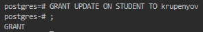

### Вибіркове керування санкціонованим доступом в СКБД PostgreSQL

> 1. Встановіть СКБД PostgreSQL, отримавши для вашої ОС інсталяційний пакет з
https://www.postgresql.org/download/.
> 2. Створіть термінальну консоль psql через утиліту командного рядка вашої ОС та встановіть з’єднання з БД postgres від імені користувача-адміністратора postgres

> 3. Зареєструйте нового користувача в СКБД PostgreSQL, назва якого співпадає з вашим прізвищем, наприклад blazhko, і довільним паролем.
> 4. Створіть роль в СКБД PostgreSQL (назва співпадає з вашим прізвищем латинськими літерами) і надайте новому користувачеві можливість наслідувати цю роль.

> 5. Створіть реляційну таблицю з урахуванням варіанту з таблиці 2.1 від імені користувача-адміністратора.
> 6. Внесіть один рядок в таблицю, використовуючи команду insert into ..., відповідно до варіанту.

> 8. Від імені нового користувача виконайте запит на отримання даних з таблиці (`select * from таблиця`). Запротоколюйте результат виконання команди.

Створено з'єднання з базою даних від імені користувача, але за замовчуванням, новим користувачам не надається прав на виконання команд.

> 9. Встановіть повноваження на читання таблиці новому користувачеві.

> 10. Повторіть крок 8.

> 11. Зніміть повноваження на читання таблиці для нового користувача.

> 12. Повторіть крок 8.

> 13. Створіть команду оновлення даних таблиці (UPDATE) і виконайте її від імені нового користувача. Проаналізуйте результат виконання команди.
> 14. Встановіть повноваження на оновлення таблиці новому користувачу.

Як і з `SELECT`, за замовчуванням не надано прав використання команди. На рисунку до п. 15 зображено спробу виконання до надання прав і після. 

> 15. Повторіть крок 13.

> 16. Створіть команду видалення запису таблиці (DELETE) і виконайте її від імені нового користувача.

> 17. Встановіть повноваження на видалення таблиці новому користувачеві.

> 18. Повторіть крок 16.

> 19. Зніміть всі повноваження з таблиці для нового користувача.

> 20. Створіть команду внесення запису в таблицю (INSERT) і виконайте її від імені нового користувача.

> 21. Встановіть повноваження на внесення даних до таблиці для ролі.
> 22. Повторіть крок 20.

Вставка об'єкта (`INSERT`) після надання прав надається успішно, але права на читання (`SELECT`) були зняті у п. 19.

