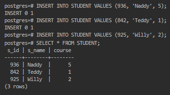
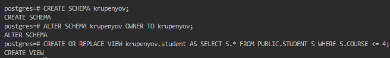
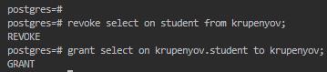
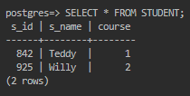
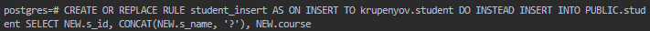
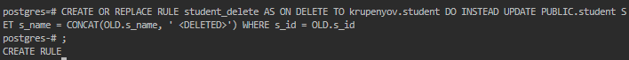
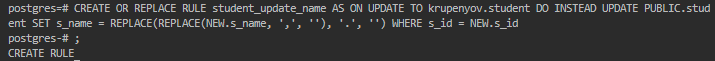
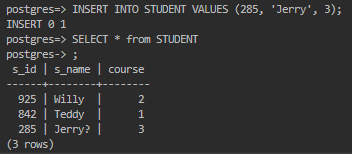
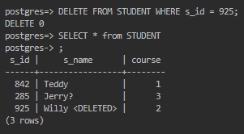
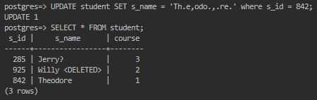

### Вибіркове керування санкціонованим доступом до даних з горизонтальним обмеженням доступу

> 1. Заповніть таблицю БД ще трьома рядками.

> 2. Створіть схему даних користувача, назва якої співпадає з назвою користувача, та створіть віртуальну таблицю у цій схемі з правилами вибіркового керування доступом для користувача так, щоб він міг побачити тільки деякі з рядків таблиці з урахуванням одного значення її останнього стовпчика.

> 3. Встановіть з’єднання з СКБД від імені нового користувача
> 4. Перевірте роботу механізму вибіркового керування, виконавши операцію SELECT до віртуальної таблиці.

Представлення `krupenyov.student` показує лише ті записи, в яких `course` не більше 4, що включає 2 з 3 записів. `SELECT` таблиці `student` з нового користувача (*префікс `=>` замість `=#`*) показує:

> 5. Створіть INSERT/UPDATE/DELETE-правила обробки операцій редагування віртуальної таблиці.

Правило `INSERT` (*дописує `?` до `s_name`*):

Правило `DELETE` (*дописує `< DELETED >` до `s_name` замість видалення*):

Правило `UPDATE` (*при зміні імені, прибирає `,` та `.`*):

> 6. Перевірте роботу механізму вибіркового керування, виконавши операції INSERT, UPDATE, DELETE до віртуальної таблиці.

