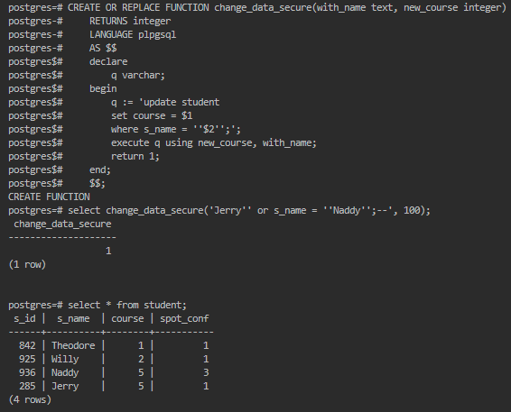
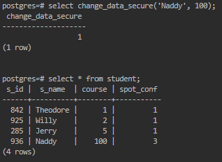
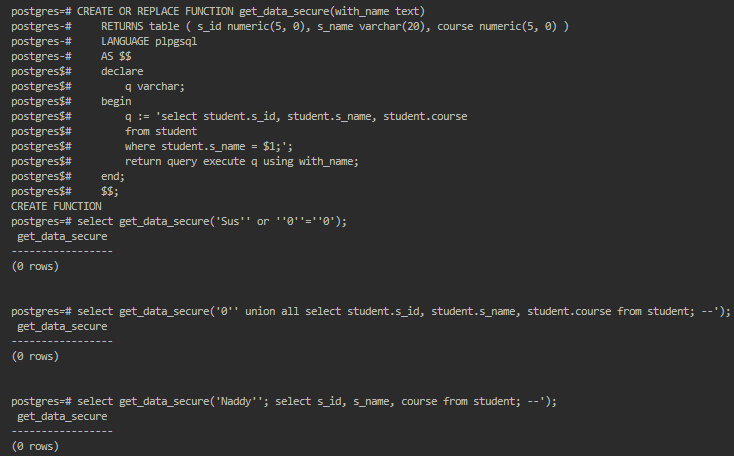

Функція змінювання значення (*запит із ін'єкцією не вносить змін*)

Легітимні запити все ще працюють коректно:

Функція отримання значення (*запит із ін'єкцією не повертає рядків*)

Запит `pg_sleep(2)` повинен відправляти відповідь лише після затримки, але `select get_data_secure('Naddy'' or exists (select 1 from pg_sleep(2));--');` не має затримки, тому ін'єкція інших сторонніх запитів також не відбувається.