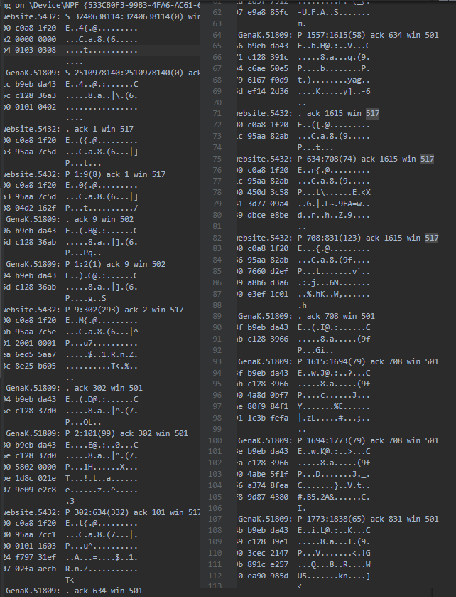
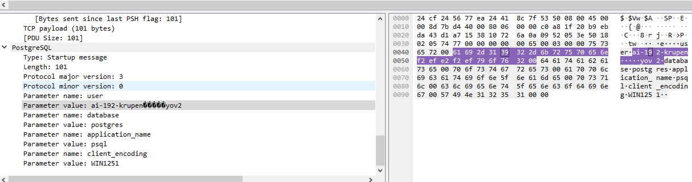
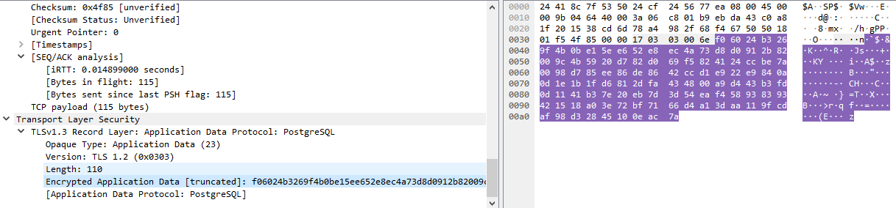

> Проаналізувати вміст перехоплених пакетів в програмі-аналізаторі.
> Підтвердити відсутність даних у відкритому вигляді.

Повідомлення тепер не містить раніше знайдені дані в відкритому (*незашифрованиому*) вигляді:

Підключення за допомогою SSL дозволяє

За допомогою WireShark, можна і перехоплювати, і аналізувати пакети даних. При підключенні Без SSL, дані пакету визначаються як призначені PostgreSQL:

Інакше, вони визначаються як "Encrypted Application Data" (*шифровані дані застосунку*):

