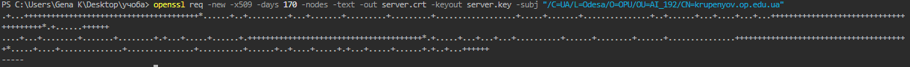

> Створити самопідписаний сертифікат для сервера СКБД PostgreSQL з наступними
> параметрами:
> − атрибути C=UA, L=Odessa, O=OPU, OU=group, CN=surname.op.edu.ua, де group –
> назва вашої групи латиницею, surname – ваше прізвище латиницею
> − строк дії сертифікату = (variant * 10) днів, де variant – значення вашого варіанту.

