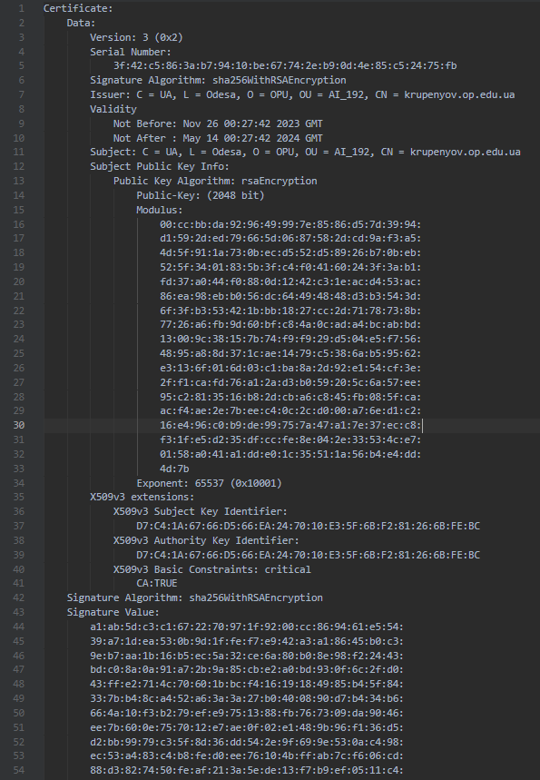
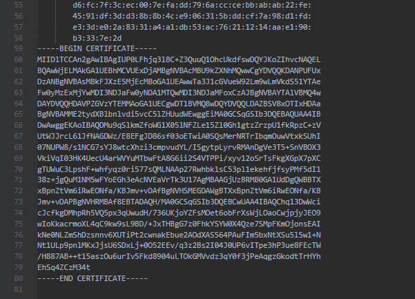

> Переглянути вміст сертифікату та визначити алгоритми створення відкритого
> ключа, а також алгоритм встановлення цифрового підпису.

Screenshots

Відкритий ключ створено за алгоритмом RSA.

Підпис встановлено за алгоритмом SHA-256, із шифруванням через RSA.
