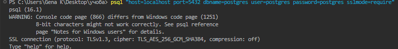

> Використовуючи програму psql, встановити TSL/SSL-з'єднання з БД за прикладом
> з лабораторної роботи No8, але використовуючи формат параметрів "host=var1 port=var2
> dbname=var3 user=var4 password=var5 sslmode=var6".
> Визначити версію TSL-протоколу та перелік використаних криптоалгоритмів.

Протокол: TLS версії 1.3.

Алгоритми шифрування: AES 256-біт із GCM; SHA 384-біт.